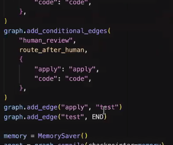

# Building an AI-Powered Code Editor

> 🔗 **Resource:** [Curriculum & Notebooks](https://orion-tutorial.vercel.app/curriculum)

---

## 📌 Executive Summary

Here is a summary of the session up until the Streaming Output topic:

The session is Day 13 of the AI Engineering Accelerator program, hosted by Kartik Mehra with Ishan Dutta as the main instructor. Ishan noted he had been sick for the past week but pushed through to teach the session. The goal of the session is to reverse engineer Cursor, the AI coding editor, and understand how to build a similar system using LangChain and LangGraph.

The session is divided into 3 notebooks:

1. **Code Generator with Tools**
2. **Self-Correcting Code Agent**
3. **Production Coding Agent**

Ishan started by explaining the fundamentals. He clarified what an LLM is, which is an AI model trained on large amounts of language data capable of understanding and outputting text. He then explained what a tool is, which is a custom function written for an AI model to perform actions that an LLM cannot do on its own, such as reading files, writing files, or searching the internet.

He explained that an AI agent is essentially a harness that allows an LLM and a set of tools to work together.

He demonstrated how to define tools in LangChain using the `@tool` decorator, explaining that the decorator creates a standard schema from the function name, parameters, and docstring, so the agent does not need to read through thousands of lines of code to understand what each tool does.

He then showed how to bind tools to an LLM using `llm.bind_tools`, and built a simple agent graph in LangGraph with two nodes: an **agent node** and a **tools node**, connected by conditional edges. The logic is that if the LLM determines a tool call is needed, it routes to the tools node; otherwise, it ends.

He demonstrated the graph in action with two examples:

- Asking what files are in the current directory (triggered the `list_directory` tool).
- Generating a calculator Python file (triggered the `write_file` tool).

Finally, he explained the importance of system prompts by showing how a basic system prompt produces bare code while an expert system prompt produces well-documented, properly formatted code following Python conventions. He also briefly touched on how different LLM models have different strengths—for example, Claude being better at planning and UI design while GPT models are stronger at engineering tasks.

---

## 📖 Detailed Session Breakdown

Here is a structured summary of the session up until the Streaming Output topic:

### 1. Overview and Introduction

- **Event:** Day 13 (final learning session) of the AI Engineering Accelerator program.
- **Host & Instructor:** Host Kartik Mehra welcomed participants and introduced Ishan Dutta, a Machine Learning Engineer at Adobe.
- **Background:** Ishan noted he had been sick for a week but wanted to deliver the session regardless, with Siddharth as backup.
- **Session Goal:** Reverse engineer Cursor (AI coding editor) and understand how to build a production-grade AI coding agent.

### 2. Session Structure

The session is divided into 3 notebooks:

1. **Code Generator with Tools**
2. **Self-Correcting Code Agent**
3. **Production Coding Agent**

---

## 🛠️ Notebook 1 — Foundations

### Core Concepts

#### What is an LLM?

- A large language model trained on massive language data.
- Capable of understanding and outputting text.
- Contrasted with SLMs (Small Language Models) which are trained on smaller datasets.

#### What is a Tool?

- A custom function written for an AI model to perform specific actions.
- **Examples:** Reading a file, writing a file, web search, accessing S3.
- LLMs cannot do these things on their own without tools.
- ChatGPT uses internal tools (e.g., PDF reader) to handle file inputs.

#### What is an AI Agent?

- A harness that combines an LLM with a set of tools so they can work together.
- It is not one big system but many small components combined.

---

### LangChain & LangGraph Mechanics

#### The `@tool` Decorator in LangChain

- Used to register a Python function as a tool.
- Creates a standard schema from the function (name, parameters, description).
- **Reason:** Instead of passing 100,000 lines of code to the agent to understand what tools do, the decorator extracts only the essential metadata (name, parameters, docstring).
- This makes tool selection faster and more accurate for the agent.

#### Binding Tools to an LLM

- Done using `LLM.bind_tools(list_of_tools)`.
- After binding, the LLM can identify which tools it needs for a given task.
- **Execution Flow:**
  - *First run:* Agent identifies which tools are needed.
  - *Second run:* Agent actually executes them.

---

### Advanced Agent Capabilities

#### ⚡ Streaming Output

- **Streaming Output in LangGraph:** To enable streaming output, switch from `app.invoke` to `app.astream_events`.
- **Streaming Events:**
  - `on_llm_new_token` for token-by-token output.
  - `on_tool_start` for tool call initiation.
  - `on_tool_end` for tool call completion.
- **Token-by-Token Generation:** LLMs generate output token by token, similar to ChatGPT’s word-by-word display.

#### 💬 Multi-Turn Conversations

- **Multi-turn Conversation in LangGraph:** Allows maintaining context across multiple messages, similar to follow-up questions in ChatGPT or Cursor.
- **Maintaining Context:** Achieved by using `messages.append` to add new messages to the existing conversation history instead of creating a new list.
- **Example of Context Retention:** After creating a logger file, a follow-up message to modify the same file will be understood by the agent due to the retained context.

#### 🏗️ Generating Structured Output

1. **Problem with Raw Output:** When using a basic `LLM.invoke` call, the output is returned as a single plain text string, making it difficult to extract specific parts like code or explanation separately.
2. **What Structured Output Solves:** Structured output allows the response to be organized into clearly defined parts, such as separating code from explanation, similar to how ChatGPT displays code in a code block and explanation as normal text.
3. **Using Pydantic BaseModel:** To enable structured output, you define a class (e.g., `CodeOutput`) that inherits from Pydantic's `BaseModel`. Inside this class, you define the fields you want, such as `"code"` (the complete Python code) and `"explanation"` (a brief description of what the code does), both as string types.
4. **Binding Structured Output to LLM:** Instead of using `LLM.invoke` directly, you use `LLM.with_structured_output` and pass the class name (e.g., `CodeOutput`) to it. This changes the return type from a plain string to an instance of your defined class.
5. **Accessing the Output:** Once the result is returned, you can access each part individually using `result.code` to get the code and `result.explanation` to get the explanation, making it very easy to directly write the code to a file without any extra parsing.
6. **Practical Importance:** This is especially important in coding agents because it allows the agent to cleanly extract generated code and save it to a file without complex string manipulation.

---

## ⚡ Executing Code with Subprocess

- Python's `subprocess` library allows you to run terminal commands from within Python code.
- A function called `execute_python` was defined, which uses `subprocess.run` with the `python -c` flag to execute any code string passed to it.
- The `python -c` flag means console mode, allowing a single line or block of Python code to be run directly from the command line.
- The function returns two outputs:
  - **Standard output (`stdout`):** Contains the result if the code ran successfully.
  - **Standard error (`stderr`):** Contains the error traceback if the code failed.
- **Examples:**
  - Passing `print("hello world")` returns a successful output.
  - Passing `print(1/0)` returns a zero division error in `stderr`.
- This mechanism is used inside the agent graph as the `execute` node to verify whether generated code actually works.

---

## 🔄 Self-Correcting Coding Agents

- The agent graph for self-correction has two main nodes: `generate` and `execute`.
- **Generate Node:** Uses an LLM to produce code and an explanation based on the given task.
- **Execute Node:** Runs the generated code using the subprocess mechanism described above.
- **Conditional Routing:** After execution, a conditional edge checks the result with three possible outcomes:
  1. *Success:* Ends the graph.
  2. *Failure with retries remaining:* Loops back to `generate`.
  3. *Failure after max attempts:* Gives up and ends.
- **State Tracking:** The agent state tracks task, generated code, explanation, error messages, attempt number, and max attempts throughout the process.
- **Retry Mechanism:** On retry, the `generate` node receives the error from the previous execution and uses it to produce a corrected version of the code.
- **Limit:** Max attempts is typically set to 3. If all attempts fail, the agent gives up rather than looping indefinitely.
- **Cursor Parity:** This mirrors the bug bot feature in Cursor, which executes code and self-corrects in a similar way.

---

## 🔍 Adding a Reviewer with Reflection Pattern

### Core Components

- **What is the Reflection Pattern?**  
  It is a system design pattern for AI agents where you add a dedicated review node that reflects on the code generated by the agent. If the output does not meet standards, it sends feedback back to the generator to fix it.

- **The Review Node Output:**  
  The review node produces two structured outputs:
  1. `"approved"`: A `true` or `false` decision on whether the code meets quality standards.
  2. `"feedback"`: Contains specific suggestions passed back to the `generate` node if the code is not approved.

- **How It Fits Into the Graph:**  
  The graph flows from `start` ➔ `generate` ➔ `execute` ➔ `review`. If `review` approves, the process ends. If `review` fails, it goes back to `generate` with the feedback so the code can be improved.

- **Why Execute Comes Before Review:**  
  Ishan explained that placing `execute` before `review` is more efficient. If execution fails multiple times, you avoid wasting tokens running the review node on broken code. The review node only runs when execution is successful.

- **What the Reviewer Checks:**  
  Beyond just running the code, the reviewer checks for code quality standards such as proper naming conventions, modular structure, descriptive variable names, documentation, and adherence to best practices that the `execute` node alone does not verify.

- **Max Attempts and Give Up State:**  
  Both the `execute` and `review` failure loops respect a maximum attempt limit. If the agent cannot produce approved code within the set number of attempts, it enters a give up state and ends the process.

> 💡 **Summary of Reflection Pattern:**
>
> - **Definition:** A system design pattern for AI agents where a dedicated review node reflects on the code generated by the agent and provides feedback for improvement.
> - **Review Node Output:** Produces "approved" (true/false) indicating if the code meets quality standards and "feedback" with suggestions for improvement.
> - **Process Flow:** Starts at `generate`, moves to `execute`, then to `review`. If `review` fails, it loops back to `generate` with feedback. If execution fails, it also loops back to `generate`. Both loops have a maximum attempt limit.

---

## 🖼️ Session Visuals & Architecture Diagrams

---

## 🤖 LLM Usage Strengths & Model Comparison

Here is a summary of what Ishan shared about different LLM models, their strengths, and how he uses them:

- **Claude Series** (e.g., Opus 4.6, Sonnet 4.6)  
  Ishan describes Claude models as having the personality of someone who is extremely skilled but lacks the experience of a senior engineer. They are excellent at planning, design, and creating front-end interfaces. He uses **Claude Opus 4.6** for planning and UI design work, and **Sonnet 4.6** for smaller tasks and backend API work.

- **GPT Series** (e.g., GPT-4.5, GPT-4o Mini)  
  Ishan sees GPT models as less strong in design and planning but highly skilled in engineering tasks due to how they were trained. He uses **GPT-4.5** for system design and backend API development, and **GPT-4o Mini** as a general lightweight model in his coding examples.

- **Gemini Models**  
  He briefly mentions using Gemini models specifically for UI design work, such as creating the Figma design for his custom coding editor called Orion.

- **General Principle**  
  Ishan emphasizes that every LLM has its own personality, and choosing the right model depends on the task at hand. For example, he used Gemini for UI design, Claude Opus for implementing the UI code, and GPT for the backend implementation of the same project. He advises matching the model's strengths to the specific task to get the best results.
