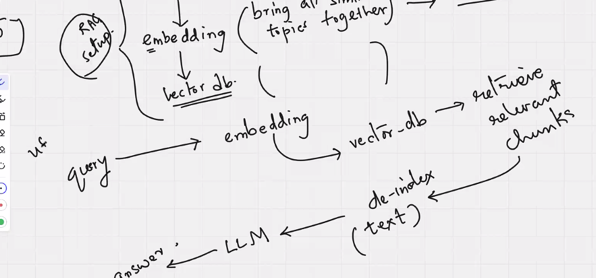
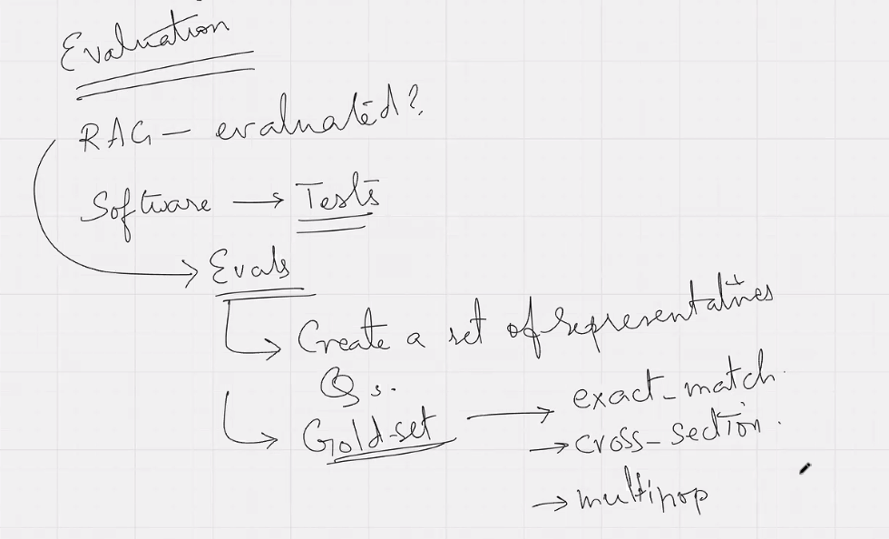
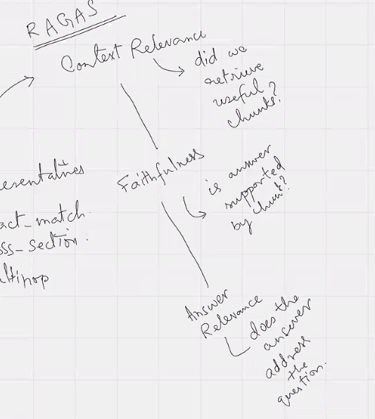
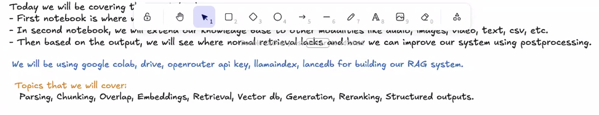

# RAG Basics + LanceDB + LlamaIndex

## Resources

Slides: <https://docs.google.com/presentation/d/1q3wSRpEjzZ9LSAKRdGjnhFkzeBL2sN0o/edit?usp=sharing&ouid=112034599433077560118&rtpof=true&sd=true>

Post Read RAG: <https://docs.google.com/document/d/1mmTHtqAbJGPfix8xDBShlfHPUBRo7Wzo9HwU-juRDfc/edit?usp=sharing>

Post Read Hands-on: <https://docs.google.com/document/d/1MTKaIZtYDUvtRV27FjqRA-r3ED3LelHSZS-fRugZRsE/edit?usp=sharing>

Notion link that has excalidraw as well used during session (hands-on):
<https://antaripasaha.notion.site/Excalidraw-Diagrams-Cohort-6-2c35314a5639807f8892f7776fdff24d>

## Notes

Relatable: When we use web search within LLM, it is already a RAG where the entire web is the RAG system. Since the LLM retrieves the indexed results from the search engine, the results are then analyzed to give the answers.


Embedding is indexing, which brings similar topics together.



Note:

* There is no relationship between embedding and the LLM used.
* Different Embeddings implementation differ in how best they bring similar topics together. (Assigning vector values)
* Tokenization could be done before embedding.
* Same embedding model should be used for query, as the one used for original embedding.

Multi-hop where answer exists across multiple documents

Evaluation Framework:
RAGAS is being used: <https://www.ragas.io/>

LLM to evaluate is not 100% perfect, however it is scalable and it would lead to a good direction.

Native RAG with embedding is good when the query has to address meaning. But when there are exact text match to be done, embeddings will not be good. This is typically the case with documentation.

Hybrid RAG Retrieval - will improve Naive RAG, to also use exact match. Where Semantic Matching as well as Keyword matching is done to come at the result. For this, reranking is done, where two searches are done - one Semantic search and rank, then a keyword search and rank, use both the ranks to derive final rank.

Hybrid retrieval changes how embeddings are used by shifting the system from a "sole reliance on semantic meaning" to a "multi-signal search." It supplements dense vector embeddings with sparse keyword search (e.g., BM25) and reranking, ensuring literal exact-match accuracy while maintaining conceptual understanding.

Ask Gemini on “how hybrid retrieval changes embedding”

NEXT IMPROVEMENT -  provide some additional context as part of ingestion process
Contextual Retrieval—involves using an LLM to generate brief, document-level context for each chunk before embedding. This prevents "out-of-context" retrieval failures

Ask Gemini on “how to put contextual chunks in building RAG” or “What is Contextual Retrieval”

NEXT IMPROVEMENT -  Try to get the user intent.
User intent is done by generating a hypothetical answer from LLM, and then attaching it to the embedding to retrieve the relevant documents.
To get user intent in a RAG system, you use a Query Transformation layer—typically a fast LLM or intent classifier—that sits between the user and your retrieval engine. This layer classifies the query type and refines the text to ensure the system fetches the exact information needed. [1, 2, 3, 4]

This is often done with HyDE and Query Decomposition.

Ask Gemini on “For RAG retrieval how to get user intent” or “For RAG retrieval what is Query Transformation layer”

NEXT IMPROVEMENT - Agentic RAG
Agentic RAG (Retrieval-Augmented Generation) is an advanced AI framework where autonomous agents actively manage the retrieval, reasoning, and validation of information, rather than passively fetching data like traditional RAG. It uses LLMs to plan, use tools (search, APIs, code execution), and iterate to handle complex, multi-step queries accurately. Unlike traditional "static" RAG, which typically performs a single retrieval step, agentic RAG creates an iterative workflow that allows for improved reliability and lower hallucination rates

Ask Gemini on “What is Agentic RAG”

Rule of Thumb for applying techniques:

* Simple factual query -> Hybrid
* Exact Terms -> Keyword based reranking
* Multi hop query —> HyDE
* Ambiguous Query —> Agentic RAG

In every case, there should be human evaluation to judge the effectiveness. In production system, take the most asked questions and use it to improve the RAG (manual feedback loop)

.png>)
===

<https://github.com/eng-accelerator/ai-accelerator-C6/tree/main/Day%206/session_2>

ATLAS System

<https://antaripasaha.notion.site/Excalidraw-Diagrams-Cohort-6-2c35314a5639807f8892f7776fdff24d>

Atlas is essentially a complete end-to-end RAG (Retrieval Augmented Generation) system, also referred to as a "second brain." The session focuses on building this internal RAG system through three main notebooks:

1. First Notebook - PDF-based RAG System:

* Uses 5 academic research papers about AI agents as the knowledge base
* Covers the complete RAG pipeline: parsing PDFs, chunking text, generating embeddings using BGE-small model, storing in LanceDB vector database, and retrieval
* Demonstrates how to query the system and get relevant answers from the research papers
* Uses LlamaIndex for document processing and LanceDB for vector storage

1. Second Notebook - Multi-modal RAG:

* Extends the knowledge base beyond text to include different modalities: audio, images, video, and text
* Shows how to build a RAG system that can handle various types of content

1. Third Notebook:

* Additional aspects of the RAG system (specific details not fully covered in this excerpt)
The session uses Google Colab for hands-on implementation to avoid environment setup issues. Students are provided with data folders containing research papers and other documents. The system uses OpenRouter API for LLM access and includes configuration for chunk size (512 tokens), overlap settings, and similarity search (top 5 chunks).
The ultimate outcome is a functional question-answering system where users can ask questions about the content in the provided documents, and the system retrieves relevant information to generate accurate answers.

Notes:

* Chunker:
  * It understands something. For example AST chunked can understand code.
* Embedding:
  * Even embedding models can be specialized for codes.

Ingesting - Chunking
.png>)
Retrieval

RAG

